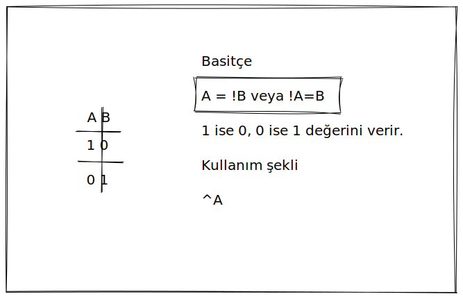

# Bitwise (Bitsel) İşlemler

Bitwise (Bitsel) işlemler yapabilmek için önce Bitwise operatörleri bilmemiz gerekir.

Bitwise (Bitsel) Operatörler ikili (binary) sayıları karşılaştırmak için kullanılır.

Anlam tablomuzu görelim

| Operatör |            Anlamı           |
| :------: | :-------------------------: |
|   A\&B   |           AND (VE)          |
|   A&^B   |      AND NOT (VE DEĞİL)     |
|    ^B    |         NOT (DEĞİL)         |
|   A\|B   |          OR (VEYA)          |
|    A^B   |       XOR (ÖZEL VEYA)       |
|   A<\<B  |  Left Shift (Sola Kaydırma) |
|   A>>B   | Right Shift (Sağa Kaydırma) |

### & - AND (VE) Operatörü

Anlaşılır bir örnek olması için 1 ve 0 sayılarından örnek görelim.


Yani `A` ve `B` binary bitini `&` ile karşılaştırmamız basitçe bu 2 biti birbiri ile binary biti olarak çarpmamız anlamına geliyor.

Örnek:

```go
fmt.Println(1&0) // 0
```

### &^ - AND NOT (VE DEĞİL) Operatörü


### | - OR (VEYA) Operatörü


Farklı şekilde düşünürsek `A` ile `B`'nin toplamı 0 değilse 1'dir.  `A+B=C` formülü `A` ve `B`'nin 1 olduğunu durumda 2 çıktığı için doğru bir önerme değildir fakat `2` diye bir binary biti olmadığı için `1` olarak düşünebiliriz. Bu da farklı bir akılda tutma yöntemi olmakla beraber kullanıp kullanmamak size kalmış. Ne kadar doğru olmasa da :smirk:

Örnek:

```go
fmt.Println(1|0) // 1
```

### ^ - XOR (ÖZEL VEYA) Operatörü


### ^ - NOT (DEĞİL) Operatörü

Bir de bu operatörün NOT işlemi için kullanımı vardır. XOR'dan yazım olarak farkı sadece sağ tarafında değişken belirtilmesidir.



Örnek:

```go
fmt.Println(1^0) // 1
```

Şuana kadar öğrendiğimiz operatörlere baktığımızda hep `0` ve `1` sayılarını kullandık. Bunun sebebi `1` ve `0` sayılarının binary karşılıkları da `1` ve `0` olduğu içindi.

### İşlemler Yapalım

`<<` ve `>>` operatörün kullanımına geçmeden önce binary sistemi daha iyi anlamak için örnekler yapalım. `<<` ve `>>` (binary shifting) operatörleri,  binary mantığını öğrendikçe daha kolay gelecektir.

İnsanlar günlük hayatında 10'luk _(decimal veya 10 tabanı)_ sayı sistemini kullanır. Yani 0-9 arası rakamları kullanarak sayılar üretiriz. Toplamda 10 adet rakam olduğu için 10'luk (decimal) sayı sistemi denir.

Fakat yukarıdaki örnekler 2'li _(binary veya 2 tabanı)_ sayı sistemini kapsar. Çünkü 1 ve 0'dan ibarettirler. Bitwise operatörleri de binary sistemi baz alarak karşılaştırma yapar.


Bu yazımızda sadece sayısal olarak gerçekleştirilen işlemlerden bahsedeceğim. Çünkü konu yeterince uzun olacak. Daha fazla uzatmayalım.


#### **Decimal'i Binary'e Çevirme**

```go
sayi := int64(13)

fmt.Println(strconv.FormatInt(sayi, 2)) // 1101
```

`strconv` paketindeki `FormatInt()` fonksiyonu ilk parametresinde `int64` tipinde değer alır, ikinci parametresinde ise hangi sayı sistemine dönüştürmek istiyorsak onu belirtiriz. Bizim durumumuzda `binary` istediğimiz için `2` yazdık.

Yani yukarıda `13` decimal sayısını binary formatında `1101`'a dönüştürdük.

Bunun için `fmt` paketini de kullanabiliriz.

```go
var x uint8 = 13
fmt.Printf("%b \n", x) //1101 
```

Göstericeğimiz değişkenin, kaç adet bitini göstereceğimizi de belirleyelim.

```go
var x uint8 = 13
fmt.Printf("%08b \n", x) //00001101
```

`uint8` tipinde bir değişken en fazla 8 bitlik değer taşıyabileceğinden 8'den fazlasını göstermeye gerek yoktur. Format karakterinin başındaki sıfır ise sol taraftaki boş bitlerin yerine 0 gösterilmesini sağlar. Bu değeri bir değişkene `string` olarak atamak isteseydik aşağıdaki gibi yapabilirdik.

```go
var xDecimal uint8 = 7
var xBinary string = fmt.Sprintf("%08b", xDecimal)
fmt.Println(xBinary) //00000111
```

Aramızda hangi mantık ile dönüştürüldüğünü öğrenmek isteyenler olabilir. Onlar için görelim.


Nasıl dönüştürme yaptığımızın mantığını öğrendiğimize göre kendimiz de bunun için bir fonksiyon üretebiliriz.

```go
func main() {
	fmt.Println("sonuç:", intToBinaryString(34))
}

func intToBinaryString(decimal int) (binary string) {

	if decimal < 0 {
		//negatif olduğu için binary değerin
		//eksi ile başlaması gerekir.
		binary = "-"

		//Bölme işleminde pozitif sonuç almak için
		//negatif is pozitife çeviriyoruz.
		decimal = -decimal // -decimal * -1 = +decimal
	}

	if decimal < 2 {
		//Decimal sayımız 0 ve ya bir ise bölme işlemi
		//yapmadan sonuç verdik.
		binary = fmt.Sprintf("%s%d", binary, decimal)
		return
	}
	
	for {
		if decimal < 2 {
			// 2'den küçük sayılar 2 ye bölünemeyeceği için
			// direkt olarak son bölümü verip döndüyü sonlardırıyoruz.
			binary = fmt.Sprintf("%d%s", 1, binary)
			break
		}

		//Elle yaptığımız işlemdeki gibi sonucu ters çevirmek yerine
		//direkt olarak ters ekleme yapıyoruz.
		binary = fmt.Sprintf("%d%s", decimal%2, binary)
		decimal = decimal / 2
		
		// Her bölmedeki çıkan biti görelim.
		fmt.Println(binary)
	}
	return
}
```

Çıktımız aşağıdaki gibi olacaktır:

> 0
>
> 10
>
> 010
>
> 0010
>
> 00010
>
> sonuç: 100010

#### **Binary'i Decimal'e Çevirme**

```go
sayi, err := strconv.ParseInt("111", 2, 64)
if err != nil {
	fmt.Println(err)
}
fmt.Println(sayi) // 7
```

Yukarıda `binary string`'imizi `int64`'e çevirmek için `strconv` paketinin `ParseInt()` fonksiyonunu kullandık.

İlk parametresine `string` tipinde `binary` sayımızı verdik. İkinci parametremizde ilk parametremize binary sayı verdiğimiz için 2 verdik. Üçüncü parametremiz ise bizim bit uzunluğumuz yani sayımızda kaç tane bit olacağıdır. Minimum 0  , maksimum 64 değerini alabilir. Örneğimizin başarılı bir şekilde çalıştığını görebiliriz.

Yukarıdaki örneğimizde bit uzunluğumuza `64` değerini verdik. Peki zaten fonksiyonun döndürdüğü tip `int64` ise biz neden burada bit uzunluğunu belirttik?

Ben merak ettiğim için bu fonksiyonun yazımıni inceledim. 64 bit uzunluğu verildiğinde aslında 63 biti parse ettiğini gördüm. Bu da fonksiyon içerisinde `bitSize - 1` şeklinde belirtilmiş. Ve bu kullanım ile maksimum bulunacak sonucu aşıp aşmadığı kontrol ediliyor.&#x20;

64 bit içerisindeki en solda bulunan bitimiz, sayının artı veya eksi yönde olup olmadığının bilgisini taşır. Aslında sayımızın yönsüz olarak değeri sağdan 63 bit içerisinde taşınır.

Bu mantık kullandığımız fonksiyonda bu şekilde kullanılmış.

Bu bilgiden sonra alakalı olarak bir örnek görelim.

```go
strconv.ParseInt("111", 2, 4)
```

Yukarıda decimal karşılığı `7` olan `111` binary sayısının dönüştürme işlemi yapılmıştır.

Burada bit boyutunun `4` verilmesinin sebebi `+111` şeklinde değerlendirilecek olması ve bu şekilde değerlendirildiğinde `4` hane içermesidir.

```go
strconv.ParseInt("-111", 2, 4)
```

`-111` şeklinde verildiğinde ise aynı şekilde `4` bit uzunluğundadır ve sonucumuz `-7` çıkacaktır.

Daha fazla detayları kurcalamak isteyenler incelemeye devam edebilir. Konuyu uzatmamak için geçiyorum.

**Peki kendimiz Binary değeri, Decimal değere nasıl çeviririz?**



Binary sayılarda, decimal sayılardaki gibi sol tarafdaki basamak veya basamakların 0 olması sayıya değer katmaz.

0101 = 101


Madem bu işlemin de nasıl yapıldığını öğrendiysek, kendimiz bir fonksiyon yazacak olsaydık nasıl yapacağımıza bakalım:

(Aslında kodumuz basit fakat yorum satırlarından dolayı karmaşık duruyor :thumbsup:)

```go
package main

import (
	"errors"
	"fmt"
	"math"
	"regexp"
	"strings"
)

func main() {
	decimal, err := binaryToDecimal("-10110")
	if err != nil {
		panic(err)
	}
	fmt.Println("sonucumuz:", decimal)
}

func binaryToDecimal(binary string) (int, error) {
	isNegative := false
	var result int

	// sadece -, 0 ve 1 karakterlerini içermesi gerekiyor.
	// + karakteri gerekli değil.
	r, _ := regexp.Compile("^\\-?[0-1]+$")
	if !r.MatchString(binary) {
		return 0, errors.New("Sadece -, 0 ve 1 karakterlerini içerebilir.")
	}

	//binary eksi ile başlıyorsa negatif
	//olarak yorumlandıracağız
	if strings.HasPrefix(binary, "-") {
		isNegative = true
		//for döngüsünde sadece bitleri kullanacağımız için
		//baştaki eksiyi kaldırıyoruz.
		binary = binary[1:]
	}

	for i, v := range binary {
		//rune tipinde gelen sayıyı int'e çevirelim
		bit := int(v - '0')

		//İşlemimiz = 2 üzeri (sağdan sola index numarası) çarpı bit rakamı
		result += int(math.Pow(2, float64(len(binary)-i-1))) * bit

		//index numarasını ters çevirmek için
		//len(binary)-i-1 kullandık.

	}

	//son olarak eksi değer ise artıyı eksiye çeviriyoruz.
	if isNegative {
		result = -result
	}
	return result, nil
}
```

Decimal ve Binary arasındaki dönüştürme mevzusunu anladığımıza göre OR karşılaştırmasına geri dönelim.

Bitwise karşılaştırmalarında, verilen iki değer de `binary` sisteme dönüştürülüp karşılaştırma işlemi yapılır.

Yani `13 | 7` karşılaştırması yapıldığında aslında `1101` ve `111` binary sayılarını `OR` mantığı ile karşılaştırıyor.

Örneğimizi görelim:

```go
fmt.Println(13 | 7) //15
```

`OR` operatörünü anlattığım bölümde bitleri karşılaştırıp ne sonuç verdiklerini gördük. Aslında mantıken `if-else`'de kullandığımız `||` operatörü ile aynı işi yapar.

Şimdi arkaplanda gerçekleşen olaya bakalım. Yani `13 | 7` karşılaştırmasında `15` nasıl bulunduğuna.

`13` ve `7` decimal sayılarının binary karşılıklarını `OR` mantığı ile karşılaştırmak için basamak uzunluğunu eşitleyelim.


& operatörünü incelemek için `13&7` karşılaştırmasının sonucuna bakalım.

```go
fmt.Println(13 & 7) //5
```

Bu karşılaştırmada `5` sonucunun nasıl bulunduğuna bakalım.


Bir de `^ - XOR (ÖZEL VEYA)` için olan örneğimizi görelim.

İşlemimiz `13^7` olacak. Sürekli decimal'i binary'e dönüştürmemek için aynı sayılar üzerinden örnek verdim :smile:

```go
fmt.Println(13 ^ 7) //10
```

Nasıl `10` sonucunun bulunduğuna bakalım.


Örneklerimizde `or`, `and` ve `xor` operatörlerinin kullanımlarını ve arkaplanda ne işlemler gerçekleştiğini gördük. Bu işlemlerimizde söz konusu olan bit rakamlarının karşılaştırılması ve buna göre sonuç üretilmesiydi. Sıra geldi shift için kullandığımız operatörlere.

### << - Shift Left (Sola Kaydırma) Operatörü

Adından da anlaşılabileceği üzere bitleri sola kaydırır. Diğer türlü düşünürsek bitlerin sağına sıfır ekler.

Örnek kullanımı:

```go
fmt.Println(7 << 6) // 448
```

Sonucun nasıl `448` çıktığına bakalım.

`7`'nin binary karşılığı `111` şeklindedir. `111` binary sayısının sağ tarafına 6 tane sıfır eklediğimizde `111000000` sayısı çıkar. Daha okunaklı olması için 4'er basamak şeklinde ayırabiliriz.

> `0001 1100 0000` şeklinde daha az göz yorucu olur.

Bu sayıyı da decimal'e çevirdiğimizde `448` sayısını elde ederiz.

Pekiştirmek istersek şunları da yapabiliriz.

```go
x := 7              // (0111)
fmt.Println(x << 1) // (1110) => 14
fmt.Println(x << 4) // (0111 0000) => 112
fmt.Println(x << 6) // (0001 1100 0000) => 448
```

#### Veri tipi detaylarına inelim

Yukarıda bit kaydırma işlemleri yaptık. `x` değişkenimize `:=` ile kısa tanımlama yaptığımız için derleyicimiz `7` sayısını `int` tipi olarak belirleyecektir.

Aslına bakarsak `int` tipi demek, 64bit sistemlerde `int64`, 32bit sistemlerde ise `int32` olduğu anlamına gelir. Yani `int`'in saklayabildiği bit boyutu (veya uzunluğu) çalıştığı işletim sisteminin mimarisine bağlıdır.

**Peki Bitwise Shifting işleminde bu konu bizi neden ilgilendiriyor?**

Basit olarak bahsetmek istediğim için örneğimizi `uint8` üzerinden verelim. (Şimdi artılar eksiler birbirine karışmasın :smirk:) `uint8` tipinde bir sayının bit boyutu adından da anlaşılacağı üzere 8'dir. `uint8`, unassigned (işaretsiz) integer olduğu için pozitif veya negatif sayı içermez. Yani dümdüz sayı saklar.

Saklayabileceği sayı aralığı, en fazla 2 üzeri 8' den 256'dır. Bu aralığa sıfır da dahil olduğu için `0-255` arası değer alabilir. Binary olarak baktığımızda `00000000` ve `11111111` aralığında binary değer taşıyabilir.

Left Shifting (sola kaydırma) yaptığımızda bitleri sağdan sola doğru iterek sağa 0 eklemiş oluyoruz.

Bu durumda da fazla sola kaydırdığımızda soldaki bitlerimiz dışarı taşmış oluyor ve taşan bitlerimiz veri tipimizin boyutundan dolayı saklanamıyor. Bir örnek görelim.

```go
var x uint8 = 7 // binary = 0000 0111
x = x << 6
// x'in binary karşılığı
// 0001 1100 0000 olması beklenirken
//uint8 tipi 8 bit saklayabildiği için
//sağdan 8 bitin solundaki bitler dışarı taştı
//yani saklanmadı
fmt.Printf("%08b %d \n", x, x) //11000000 192
// Bu yüzden değerimiz 448 yerine 192 olduo
```


### >> - Shift Right (Sağa kaydır)

Bu işlemde sola kaydırmanın tam tersini yapıyor. Yani bitleri sağa doğru itip boş kalan yerleri sıfır ile dolduruyor olarak düşünebiliriz. Aynı şekilde veri tipinin boyutuna etki eden nedenlerdendir.

```go
var x uint8 = 7 // binary = 0000 0111
x = x >> 1
fmt.Printf("%08b %d \n", x, x) //00000011 3
```


